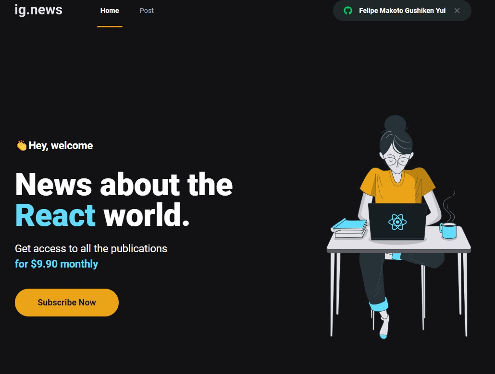
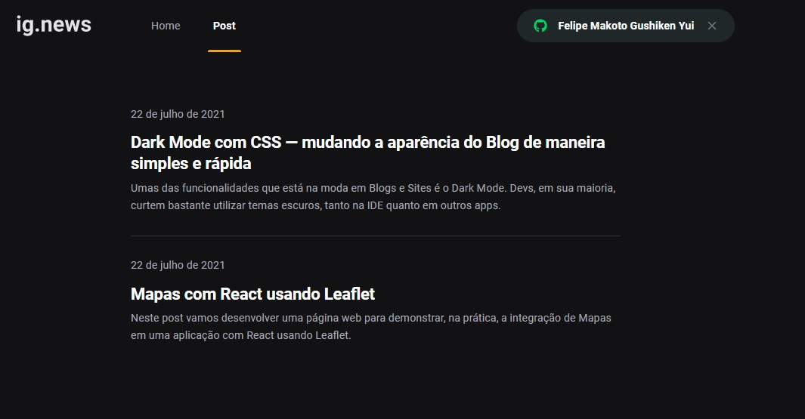
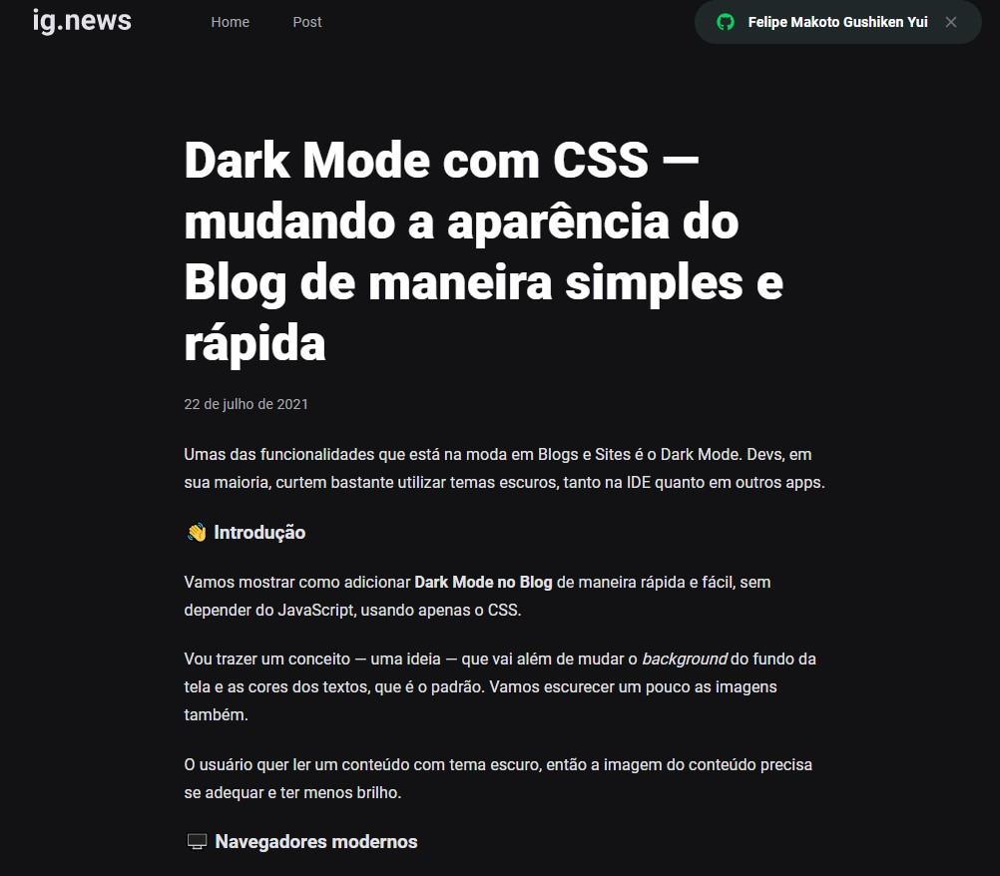
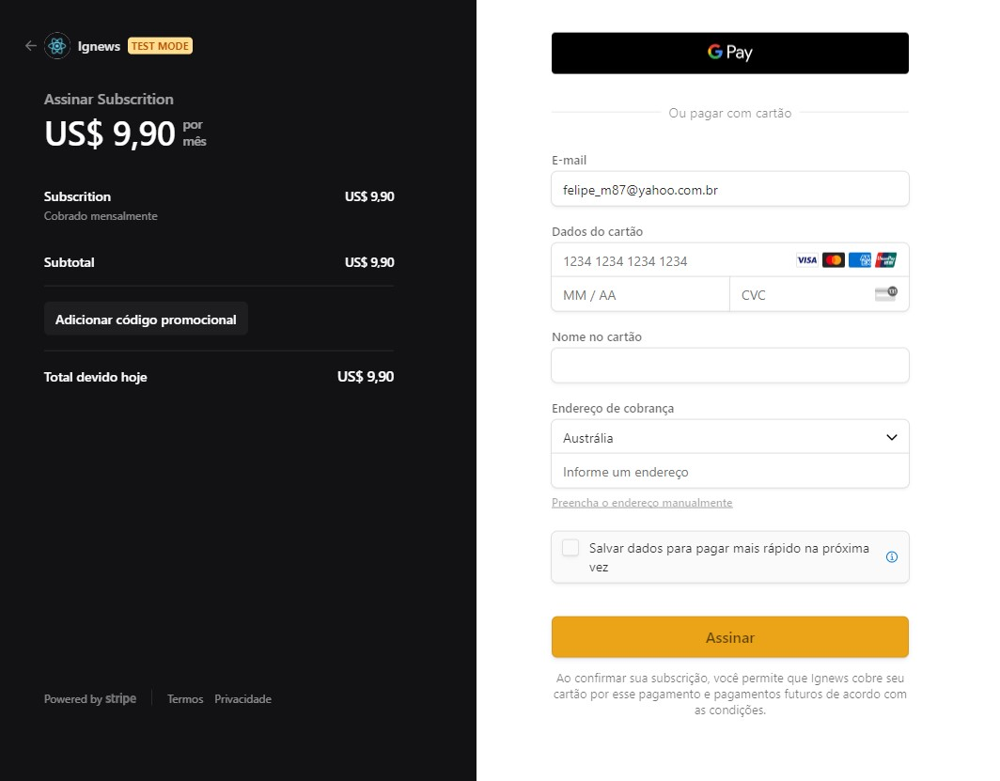
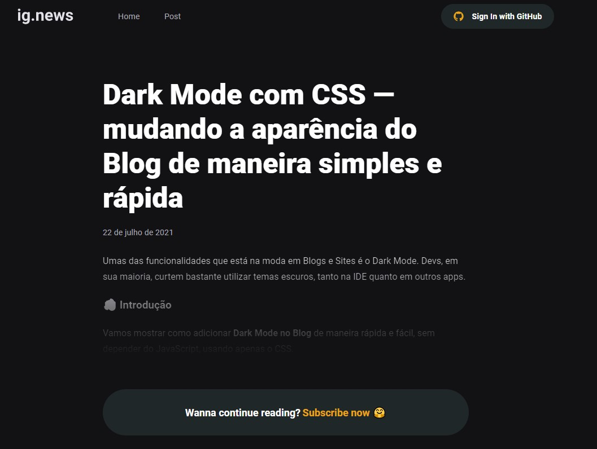

<h1 align="center">
  
</h1>

## 💻 Project

The project aims to study and develop an application in ReactJS with NextJS for post listing and subscription system.

The application was developed using the NextJS framework applying concepts such as external API consumption, Root API, Server Side Rendering (SSR), Static Site Generation (SSG), STRIPE for subscription payments, NextAuth for authentication with Github, FaunaDB to store information database and Prismic CMS for adding and managing post content.

<p align="center">
  
  
  
  
  

</p>

---

## 🧪 Technologies

Project developed with the following technologies:

- [ReactJS](https://reactjs.org/)
- [NextJs](https://nextjs.org/)
- [TypeScript](https://www.typescriptlang.org/)
- [SASS](https://sass-lang.com/)
- [Next Auth](https://next-auth.js.org/)
- [Stripe](https://stripe.com/)
- [FaunaDB](https://fauna.com/)
- [Prismic CMS](https://prismic.io/)

---

## 🚀 How to run the project

### **Requirements**

Necessary to carry out the installations:

- [Git](https://git-scm.com/)
- [Yarn](https://classic.yarnpkg.com)
- [Stripe CLI](https://stripe.com/docs/stripe-cli)

Create account and configure external services:

- [Stripe](https://stripe.com/)
- [FaunaDB](https://fauna.com/)
- [Prismic CMS](https://prismic.io/)

*Services settings are located in the servicesConfig.md file at the root of the project.*

Clone the project and access its folder.

```bash
$ git clone https://github.com/felipekejo/ignews.git
$ cd ignews
```

To start it, follow the steps below:
```bash
# Install all the dependencies
$ yarn

# At the root of the project create a copy of the file .env.local.example
# Change the copy name to .env.local
# Fill in the environment variables according to the instructions
$ cp .env.local.example .env.local

# Start the project
$ yarn start
```
The app will be available in your browser by address http://localhost:3000.

---


## 🔖 Layout

You can view the project layout through the link below:

- [Layout Web](https://www.figma.com/file/kM0ekSAulo6x1KuMvAO7xw/ig.news-(Copy)?node-id=1%3A3)

---

## 📝 License

This project is under the MIT license. See the [LICENSE](LICENSE.md) file for more details.
